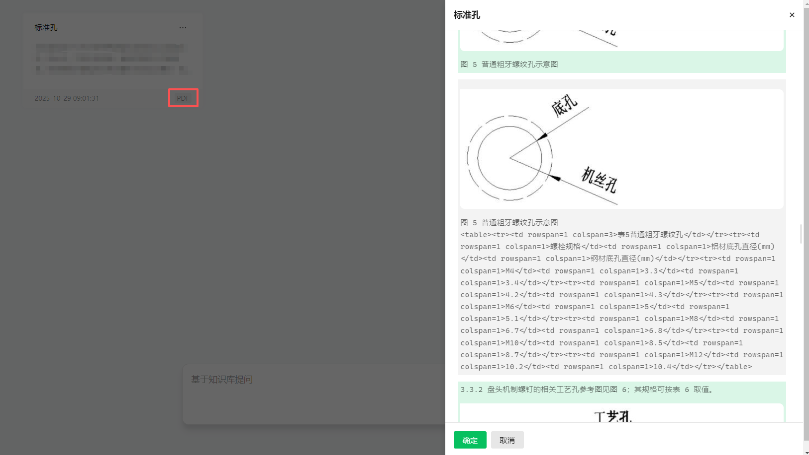

> **WeKnora‑pro** 是基于原始 **WeKnora** 的二次开发版本，核心在于提升文档解析能力。  
> 主要改进：
> * 支持扫描件通过 **Mineru‑API**（CPU/GPU 自动优化）进行 OCR 与表格提取；且兼容WeKnora多模态增加
> * 文档大小上限提升至 300 MB  

<p align="center">
  <picture>
    
  </picture>
</p>

---

## 📌 项目简介

- **解析增强**：新增mineru后端的pdf解析器
- **大文件支持**：最大单文件 300 MB
- **微信生态兼容**：可无缝集成到公众号、小程序等微信场景。

---

## 🚀 快速开始

> 所有步骤均基于 Linux/ macOS（Windows 亦可），请先确保已安装以下工具：

| 工具 | 官网 |
|------|------|
| Docker | https://www.docker.com/ |
| Docker‑Compose | https://docs.docker.com/compose/ |
| Git | https://git-scm.com/ |

### 1️⃣ 克隆仓库

```bash
git clone https://github.com/xiaohuangpin/WeKnora-pro
cd WeKnora-pro
```

### 2️⃣ 配置环境变量

```bash
cp .env.example .env      # 拷贝示例文件
# 使用编辑器修改 .env，填写数据库、Redis、OpenAI 等配置信息
# 注意文件存储类型最好为minio,local选项无法启动多模型增强
```

> 所有变量说明已在 `.env.example` 注释中提供。

### 3️⃣ 构建镜像并启动服务

```bash
# ① 构建镜像（含 Ollama 与后端容器）
./scripts/build_images.sh

# ② 启动所有服务（默认不拉取最新镜像，若需可去掉 --no-pull）
./scripts/start_all.sh --no-pull
```

> **⏰** 第一次启动可能需要 5‑10 min 进行镜像下载与初始化。

### 4️⃣ 启动 Mineru 服务（一个强大的文档解析）

```bash 
# 创建 Python 虚拟环境
conda create -n mineru python=3.10
conda activate mineru

# 安装依赖
pip install uv -i https://pypi.tuna.tsinghua.edu.cn/simple   # 若无网络，直接 pip
uv pip install -U "mineru[core]"  # 启动 API（若占用显存 > 16 GB，可根据需要改为 mineru[all]）会有更快解析速度

cd wed_api
python web_api.py
```

> **🛑** 文档解析完成后按 `Ctrl+C` 停止服务，释放显存。此操作不会影响问答功能。

### 5️⃣ 停止所有服务

```bash
./scripts/start_all.sh --stop   # 或者
make stop-all
```

---

## 🌐 服务访问地址

| 类型 | URL |
|------|-----|
| Web UI | `http://localhost` |
| 后端 API | `http://localhost:8080` |
| 链路追踪（Jaeger） | `http://localhost:16686` |

> 若部署在远程服务器，请将 `localhost` 替换为对应主机 IP。

---

## 🔧 贡献指南

1. Fork 本仓库。  
2. 克隆到本地：  

   ```bash
   git clone git@github.com:<你的用户名>/WeKnora‑pro.git
   cd WeKnora‑pro
   ```

3. 创建并切换分支：  

   ```bash
   git checkout -b feature/<描述>
   ```

4. 提交前请确保：

   * 代码遵循 `PEP8`（Python） / `prettier`（JS）规范。  
   * 添加/更新单元测试，覆盖率 ≥ 80%。  
   * 更新文档、说明文件。  

5. 推送并提交 PR：  

   ```bash
   git push origin feature/<描述>
   ```

6. 等待项目维护者审阅。

---

## 🙏 鸣谢

本项目基于以下开源组件：

- [WeKnora](https://github.com/Tencent/WeKnora)
- [Mineru](https://github.com/opendatalab/MinerU)

---

## 📜 许可证 & 使用限制

1. **AGPL‑v3**：  
   * 所有衍生代码必须同样遵循 AGPL‑v3。  
   * 若通过网络服务提供软件，用户可下载对应源码（第13条）。  

2. **商用说明**  
   * 允许商业使用，包括 SaaS 与企业内部部署。  
   * 若不修改原始代码，仍需公开完整源代码并满足 AGPL‑v3 条件。  
   * 要进行闭源商用，请取得所有版权方书面授权。  

3. **免责声明**  
   本项目提供“按现状”服务，无任何担保。使用者须自行评估合规风险，必要时请咨询专业律师。

---